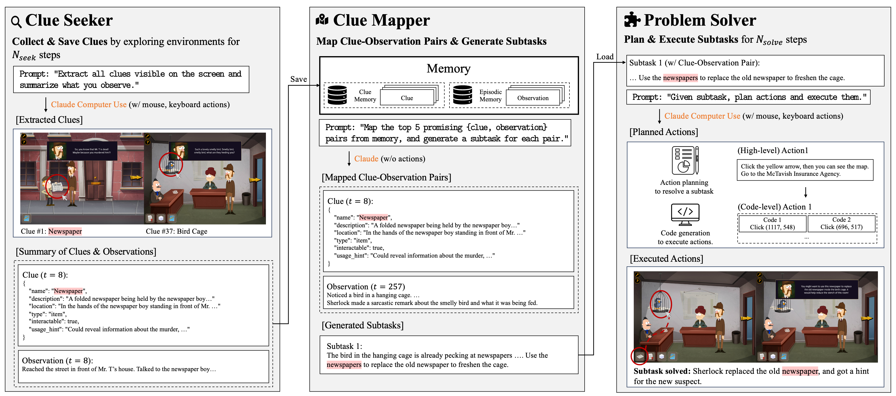

# **FlashAdventure: A Benchmark for GUI Agents Solving Full Story Arcs in Diverse Adventure Games**

<div align="center">

[](https://arxiv.org/abs/2509.01052)
[](https://ahnjaewoo.github.io/flashadventure)<br>
[]()
[]()
</div>


## 🔎 FlashAdventure

To address the limitations of existing benchmarks that lack diversity and rarely evaluate agents on completing full story arcs, we introduce **FlashAdventure**, a benchmark of 34 Flash-based adventure games. Unlike prior work that focuses on short-term objectives or isolated missions, FlashAdventure evaluates whether GUI agents can solve entire narrative-driven tasks, capturing the challenges of inventory management, branching dialogues, and long-term reasoning.  

A central difficulty in this setting is the **observation–behavior gap**, where agents must recall information observed much earlier and apply it later in gameplay. To overcome this, we propose **CUA-as-a-Judge**, an automated evaluator that verifies progress through predefined milestones, and **COAST**, an agentic framework that leverages long-term clue memory to improve sequential planning and problem solving.  

Our experiments show that current GUI agents struggle with completing full storylines, while COAST significantly improves milestone success rates by bridging the observation–behavior gap. Together, these contributions provide a comprehensive benchmark and framework for advancing long-horizon reasoning in GUI agents.  

<div align="center">

</div>


## 📢 Updates

### 🆕 2025-09-01: Official Version Released!  
This is now the official repository of the project!  
You can find more information on our FlashAdventure project page by clicking the project badge above.  

### 2025-08-21: Major Update!  
Our paper *FlashAdventure* was accepted at **EMNLP 2025 (Main Track)**, and we are releasing **COAST** and **CUA-as-a-Judge**.  

🚀 Key Highlights:  
1. **FlashAdventure Release**  
   - A benchmark of 34 Flash-based adventure games with complete story arcs.  
   - Includes **CUA-as-a-Judge**, an automated evaluation system for milestone-based scoring.  

2. **COAST (Clue-Oriented Agent for Sequential Tasks) Framework**  
   - A framework that addresses the observation–behavior gap through long-term clue memory.  
   - Designed to improve sequential planning and narrative completion in GUI agents.  

3. **Other Game Agent Baselines**  
   - In addition to COAST, we also release the reproduced frameworks used in our experiments, including Cradle, OSWorld-based UI-TARS, Claude Computer Use, and GPT Operator.  

## ✨ Key Features

- **Milestone-Based Evaluation**: A robust evaluation system that measures agent progress on specific sub-tasks, providing fine-grained insights.  
- **Comprehensive Game Suite**: A collection of diverse Flash adventure, escape room, and puzzle games designed to test a wide range of reasoning skills.  
- **Unified Codebase**: A modular framework that makes it easy to integrate and test different agents and models.  
- **Agent Variety**: Support for agents from OpenAI, Anthropic, and open-source implementations such as UI-TARS.  


## 🌊 COAST Framework & CUA-as-a-Judge

**COAST (Clue-Oriented Agent for Sequential Tasks)** addresses the observation–behavior gap through a *Seek–Map–Solve* cycle, maintaining and applying long-term clue memory during gameplay.  

**CUA-as-a-Judge** acts as an oracle with access to predefined success milestones for each game. It interacts with the environment to verify milestone completion and, after a game agent finishes, resumes from the final state to check progress—simulating a human evaluation process.  

<div align="center">

</div>


## 💾 Installation

### 1. Prepare the Environment

You can set up FlashAdventure in two ways:  
- **Conda virtual environment:**  
  The agent runs directly on the user’s local computer (e.g., desktop/laptop), not on a remote server.  

- **Docker environment(to be updated!):**  
  The agent runs only inside the Docker container.

**1.1. Conda Environment**  

```bash
# Clone the repository
git clone https://github.com/ahnjaewoo/flashadventure.git
cd flashadventure

# Create and activate a new Conda environment
conda create -n flashadventure python=3.11 -y
conda activate flashadventure

# Install dependencies
pip install -r requirements.txt
```

**1.2. Docker Environment(to be updated!)**  
For stability, Docker can be used.
By running with Docker + Xvfb, it is possible to execute GUI agents without physical display constraints. Integration with **[trycua](https://www.trycua.com/)** is also available for safe usage.

With either setup, you can run our models and experiments in a fully isolated environment.
***Note: This section is to be updated.***

### 2. Configure API Keys

Create a `.env` file in the project’s root directory to store your API keys:
```ini
OPENAI_API_KEY="sk-xxxxxxxxxxxxxxxxxxxxxxxx"
ANTHROPIC_API_KEY="sk-xxxxxxxxxxxxxxxxxxxxxxxx"
```

### 3. Download FlashGame

Since official Flash support has ended, you can use **[Flashpoint Archive](https://flashpointarchive.org/)** to play preserved Flash games. You can also enjoy escape room games at **[Masa's Games](https://masasgames.com/)**. 

*Note: Flashpoint is available on Windows, MacOS, and Linux. Please install the version appropriate for your operating system to play the games.*

### 4. Display Setting

**4.1. Display Resolution:**  
We implemented code that adjusts the display resolution to enable proper visual perception. However, some displays (e.g., Mac Retina Display) may cause errors.  
We recommend using a **sub-FHD monitor** to prevent resolution issues.
 
 **4.2. Main Display Requirement:**  
You need to run the game on the **main display** of your OS for proper screen recognition.  
Display settings can be changed in the code, so please configure your display carefully.  

## 🎮 Game Agents and CUA-as-a-Judge

Each reproduced agent framework and evaluation setup includes a dedicated README in its directory.

- Game Agents: In addition to COAST, we provide reproduced implementations of Cradle, OSWorld-based UI-TARS, Claude Computer Use, and GPT Operator game agent baselines.
- CUA-as-a-Judge: A lightweight evaluator for milestone-based scoring. Predefined milestones are provided for our benchmark games, and additional games can easily be added.


## 😀 Authors and Citation

**Jaewoo Ahn***, **Junseo Kim***, Heeseung Yun, Jaehyeon Son, Dongmin Park, Jaewoong Cho, **Gunhee Kim**

Please cite our paper if you use the code or data in this repository:


```bibtex
@inproceedings{ahn2025flashadventure,
  title={FlashAdventure: A Benchmark for GUI Agents Solving Full Story Arcs in Diverse Adventure Games},
  author={Ahn, Jaewoo and Kim, Junseo and Yun, Heeseung and Son, Jaehyeon and Park, Dongmin and Cho, Jaewoong and Kim, Gunhee},
  booktitle={EMNLP},
  year={2025}
}